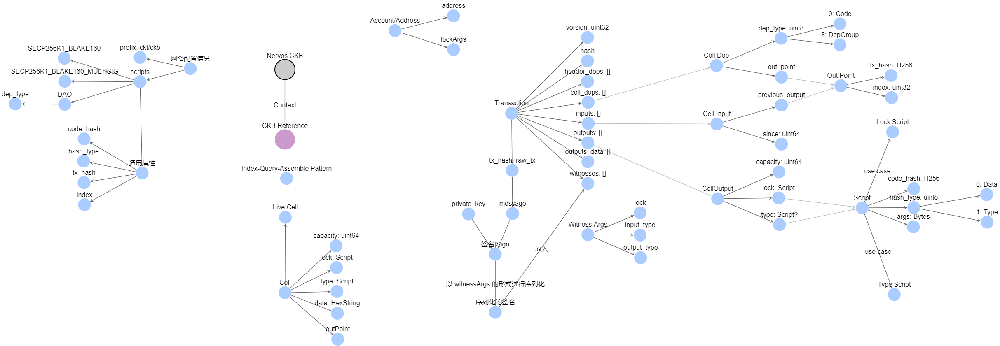

# Start

## 1. Understanding cell/transaction structure
* [Cell](https://docs.nervos.org/docs/reference/cell)
* [Script](https://docs.nervos.org/docs/reference/script)
* [Transction](https://docs.nervos.org/docs/reference/transaction)
* [理解CKB的Cell模型](https://talk.nervos.org/t/ckb-cell/1562)
* [思维导图](https://lore.chuci.info/taurenshaman/mind/6531025bf8aa4d57991e9744c2ea266b)

## 2. Dev Tools
* [Testnet Faucet](https://faucet.nervos.org/)
* [ckb-cli](https://github.com/nervosnetwork/ckb-cli): generate accounts, generate mock transactions and verification under the debugging environment
* [Capsule](https://github.com/nervosnetwork/capsule): a framework to create, build, test, deploy contracts
* [Examples for debugger](https://github.com/nervosnetwork/ckb-standalone-debugger/tree/develop/ckb-debugger/examples)

## 3. Tips
* [Debugging CKB Script](https://docs.nervos.org/docs/essays/debug)
* [Profiling CKB Script](https://docs.nervos.org/docs/essays/pprof)

## 4. Learning resources
Dapps with CKB workshop
* [Lecture 1: Introduction](https://www.youtube.com/watch?v=iVjccs3z5q0)
* [Lecture 2: On-chain Scripts with Capsule](https://www.youtube.com/watch?v=NcN3NiBuJbo)